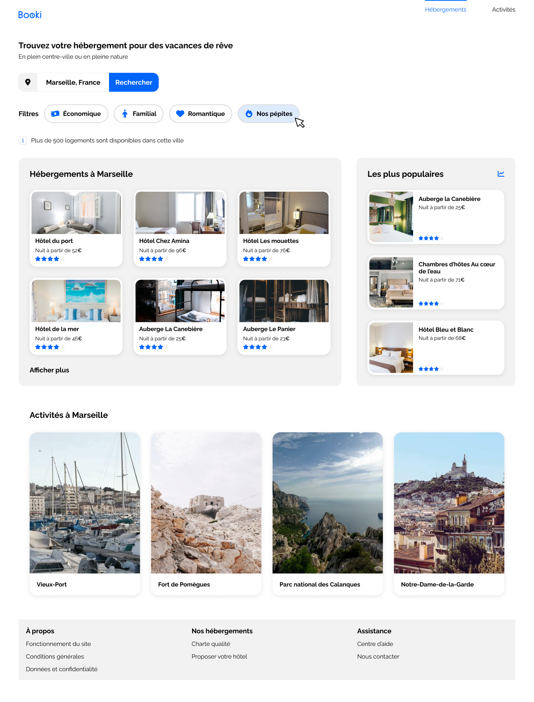

# Créez la page d'accueil d'une agence de voyage avec HTML & CSS
Création d'une landing page permettant aux usagers de trouver des hébergements et des activités dans la ville de leur choix.

### Objectif du projet : 
- Implémenter une interface responsive avec HTML et CSS
- Installer un environnement de développement front-end
- Intégrer du contenu conformément à une maquette Figma en HTML et CSS

▶ [Voir le projet : Booki](https://skies-land.github.io/Projet_3_OpenClassrooms_-_Booki/)    

